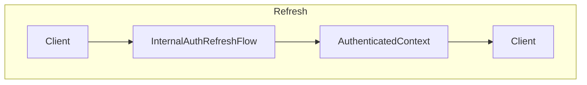
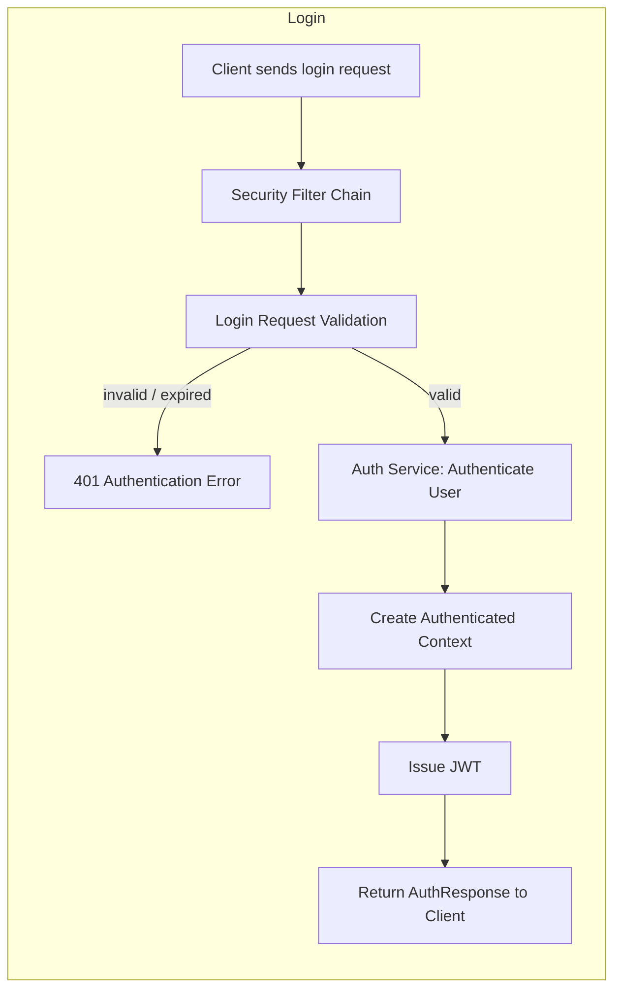
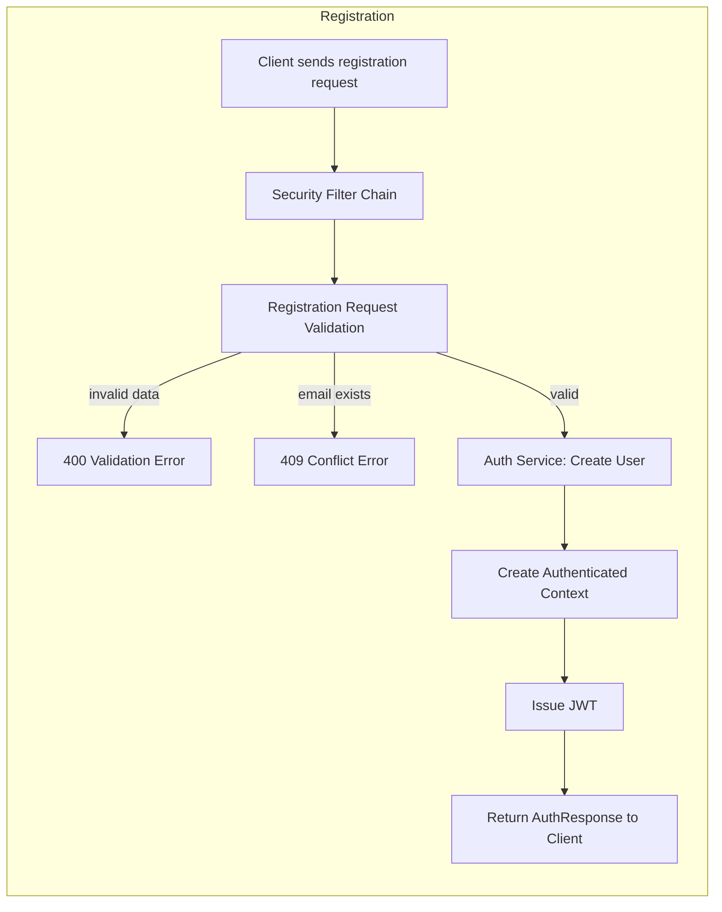
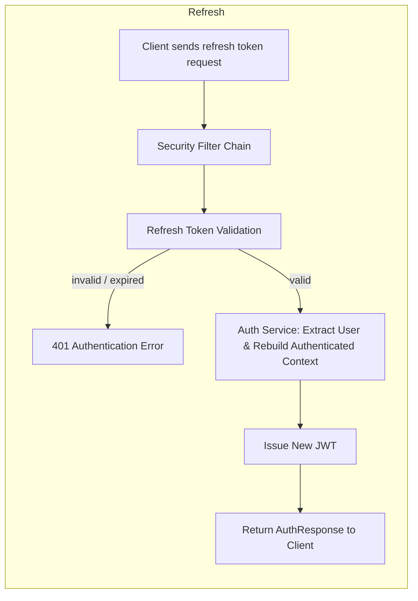

# Auth Flows:

## Business View:

1. Login Flow:
    ```mermaid
   graph TD;
    subgraph "Login"
        A[Client] --> B[InternalAuthLoginFlow]
        B --> C[AuthenticatedContext]
        C --> D[Client]
    end
    ```

2. Registration Flow:
     ```mermaid
   graph TD;
    subgraph "Registration"
        A[Client] --> B[InternalAuthRegisterFlow]
        B --> C[AuthenticatedContext]
        C --> D[Client]
    end
    ```

3. Refresh Flow:


## Internal View:

### 1. Login Flow



### 2. Registration Flow



### 3. Refresh Flow:



## Legend

- [Validation] steps marked here represent required behavior.
- Some validation steps are not yet implemented (WIP).

