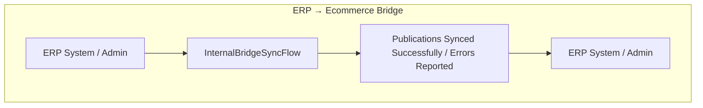
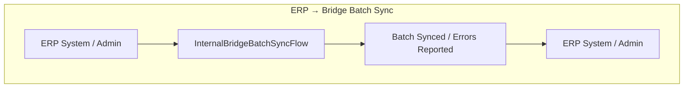
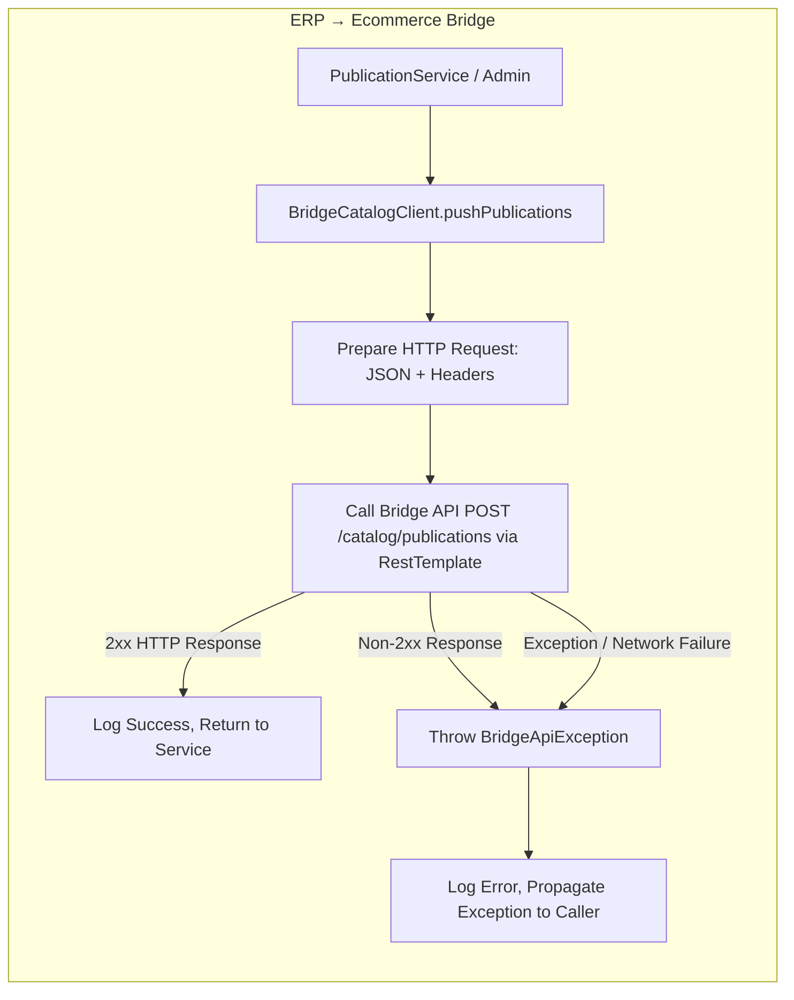
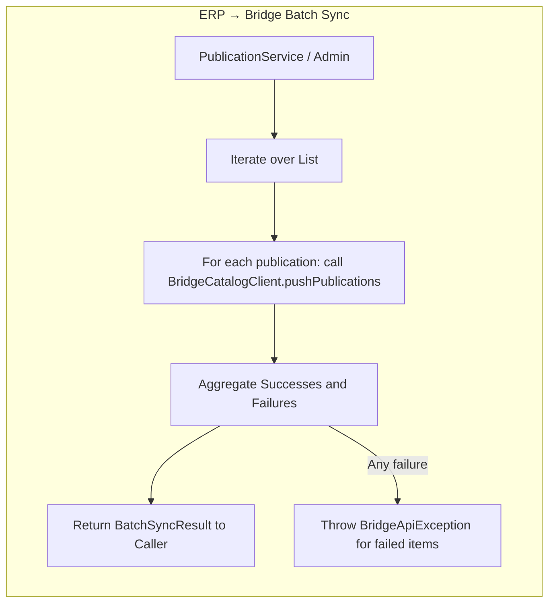

# ERP → Ecommerce Integration Flows

## Business View

### 1. Push Publications to Bridge

### 2. Push Multiple Publications (Batch)

## Internal View:
### 1. Push Single Publication — Technical Flow

### 2. Push Multiple Publications — Batch Flow

## Legend

- Business View: abstract flows for stakeholders
- Internal View: step-by-step technical workflow
- Batch flow included for completeness