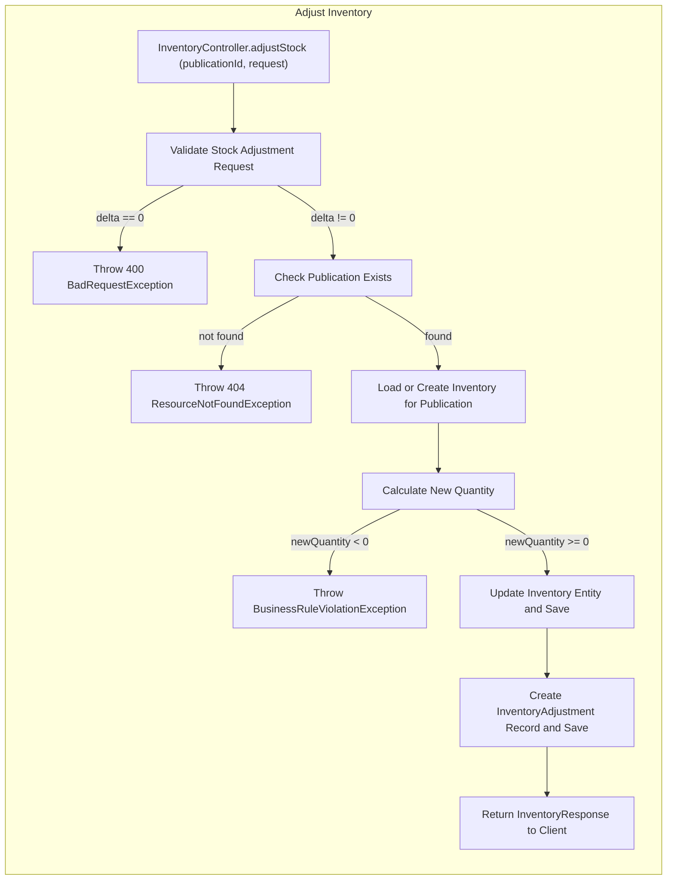
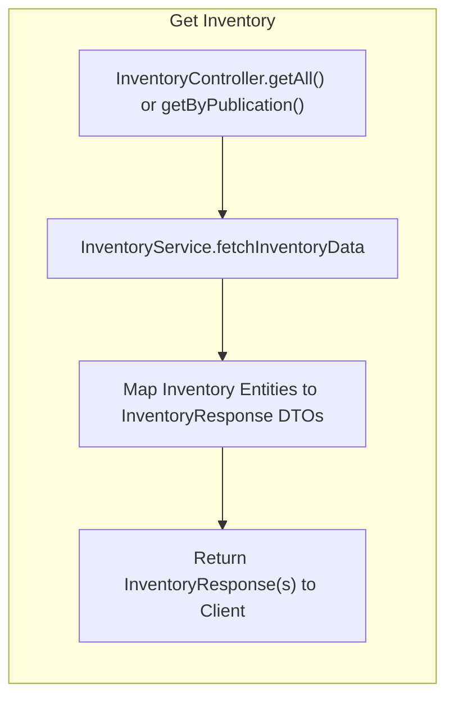
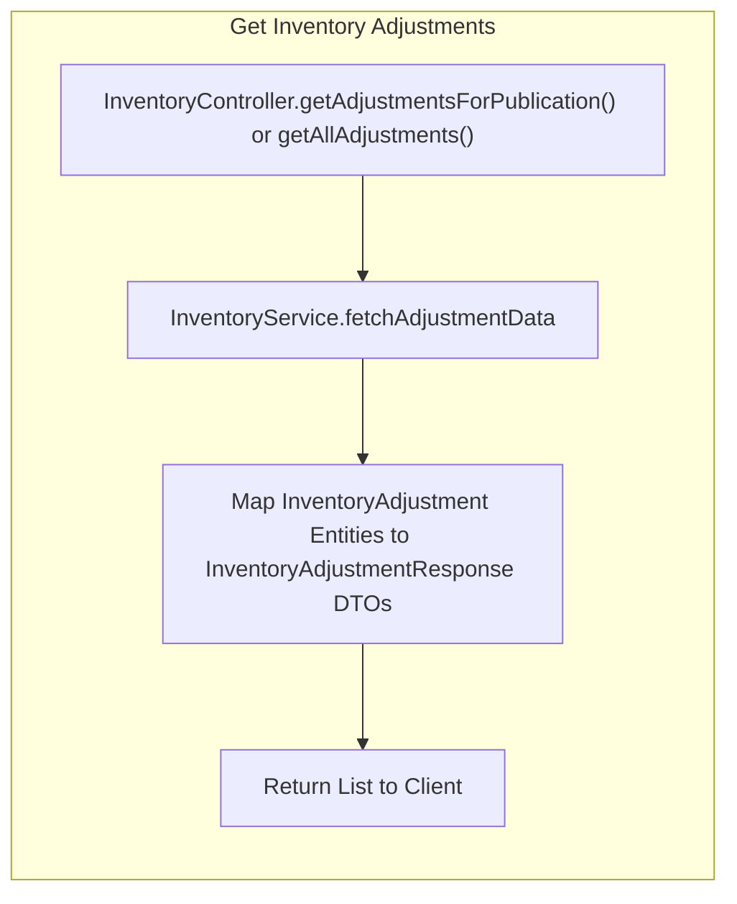

# Inventory Flows:
## Business View:

1. Adjust Inventory:
    ```mermaid
   graph TD;
   subgraph "Adjust Inventory"
        A[Client / Order System] --> B[InternalInventoryAdjustmentFlow]
        B --> C[Inventory Updated / Adjustment Recorded]
        C --> D[Client / Order System]
    end
    ```

2. Get Inventory:
     ```mermaid
   graph TD;
     subgraph "Get Inventory"
        A[Client / Order System] --> B[InternalInventoryQueryFlow]
        B --> C[Inventory Data Returned]
        C --> D[Client / Order System]
    end
    ```
3. Get Inventory Adjustments:
     ```mermaid
   graph TD;
    subgraph "Get Inventory Adjustments"
        A[Client / Order System] --> B[InternalInventoryAdjustmentQueryFlow]
        B --> C[List of Adjustments Returned]
        C --> D[Client / Order System]
    end
    ```

## Internal View:
### 1. Adjust Inventory — Technical Flow



### 2. Get Inventory — Technical Flow



### 3. Get Inventory Adjustments — Technical Flow



## Legend

- [Validation] steps marked here represent required behavior.
- Internal View diagrams show technical workflow, including validation, business rules, persistence, and exception handling.
- Adjustments triggered by orders (create/cancel) or manual operations all flow through InternalInventoryAdjustmentFlow.
- All exceptions are handled via GlobalExceptionHandler.
- Inventory and adjustments are consistent, atomic, and auditable.