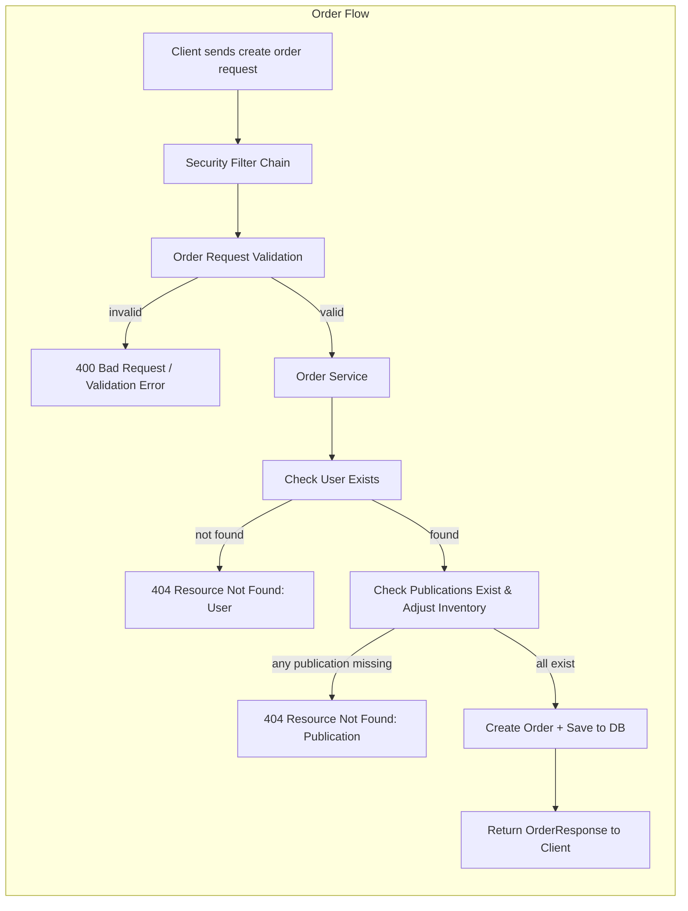
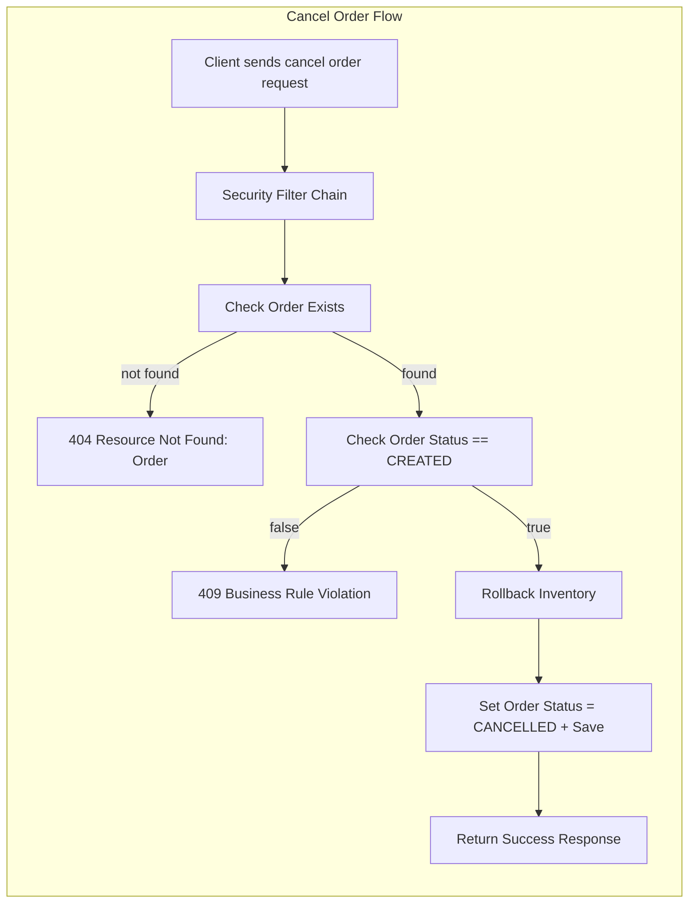
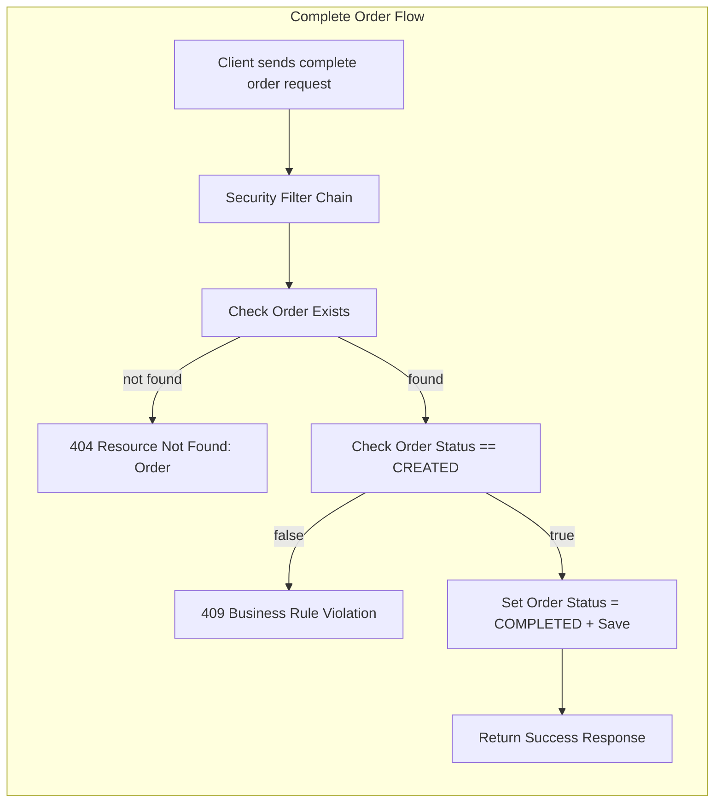
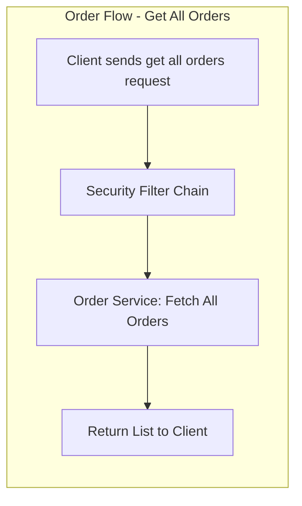

# Order Flows:
## Business View:

1. Create Order:
   [Client] -> [OrderController.createOrder] -> [OrderService.create] -> [InventoryService.adjustStock] -> [Order Saved] -> [Client]

2. Cancel Order:
   [Client] -> [OrderController.cancel] -> [OrderService.cancel] -> [InventoryService.adjustStock (rollback)] -> [Order Updated] -> [Client]

3. Complete Order:
   [Client] -> [OrderController.complete] -> [OrderService.complete] -> [Order Updated] -> [Client]

4. Get All Orders:
   [Client] -> [OrderController.getOrders] -> [OrderService.getAllOrders] -> [Client]

## Internal View:
### 1. Create Order Flow

### 2. Cancel Order Flow

### 3. Complete Order Flow

### 4. Get All Orders Flow

## Legend

- [Validation] steps marked here represent required behavior.
- All exceptions are handled via GlobalExceptionHandler (ResourceNotFound, BusinessRuleViolation, ValidationError, etc.).
- Inventory adjustments are atomic and consistent.
- Orders cannot be modified after completion or cancellation.